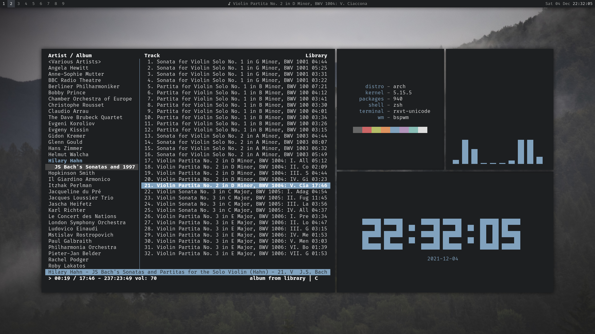

# Arch

## Desktop


## Music


## Editing


## Rofi custom menus

### Timetable/calendar
The [today.sh](bin/today.sh) script shows a sumamry of today's events, as specified in the `~/.config/calendar` file.
Hitting enter on any event opens the corresponding Google Meet code in the browser; this setup is inteded to make organizing
and joining my online classes easier.

The [calendar_notify.sh](bin/calendar_notify.sh) script reads the same file and pushes a notification if an event is coming up
in 5 minutes (or any interval of choice) - I have this triggered every minute by `systemd`.

Following is an example calendar file.
```conf
# ~/.config/calendar

# TIMETABLE
# Time,    Title,  Description,                                 Meet Code / Extra Info

# Monday
09:00 Mon, MA3102, Algebra I,                                   ewe-muaj-uzb
10:00 Mon, HU3101, History and Philosophy of Science,           jfp-cakb-kmq
12:00 Mon, MA3104, Linear Algebra II,                           zpy-scdf-fkm
15:00 Mon, MA3103, Intro to Graph Theory and Combinatorics,     urj-ystv-uig
19:00 Mon, MA3101, Analysis III,                                xhv-usmm-emv

# Tuesday
09:00 Tue, MA3103, Intro to Graph Theory and Combinatorics,     urj-ystv-uig
10:00 Tue, MA3104, Linear Algebra II,                           zpy-scdf-fkm
11:00 Tue, HU3101, History and Philosophy of Science,           jfp-cakb-kmq
12:00 Tue, MA3102, Algebra I,                                   ewe-muaj-uzb 

# Wednesday
12:00 Wed, MA3104, Linear Algebra II,                           zpy-scdf-fkm 
19:00 Wed, MA3101, Analysis III,                                xhv-usmm-emv

# Thursday
17:00 Thu, MA3102, Algebra I,                                   ewe-muaj-uzb
19:00 Thu, MA3101, Analysis III,                                xhv-usmm-emv

# Friday
11:00 Fri, HU3101, History and Philosophy of Science,           jfp-cakb-kmq
15:00 Fri, MA3103, Intro to Graph Theory and Combinatorics,     urj-ystv-uig
17:00 Fri, MA3105, Numerical Analysis,                          yfs-gpam-oam

# WEEKLY EVENTS
18:00 Wed, Summer Project, Weekly meeting on Mathematics,       ori-vmjk-ijn

# YEARLY EVENTS
00:00 January 1 next year, Happy New Year!, ,
12:00 March 1, Happy Birthday!, ,

# CALENDAR EVENTS
15:30 July 12 2021, Chess WC, *Chess World Cup 2021*,
```

# MacOS

### Cmus


### Irssi


### Vim


## Wallpapers


